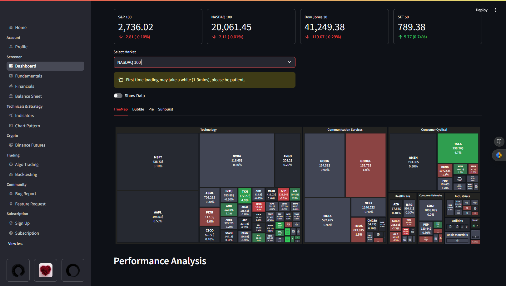

# Stock and Crypto Currency Dashboar

Hello, fellow developers! 👋
Welcome to my stock and Crypto Currency Dashboard project! 🚀
This project is a simple yet powerful dashboard that allows you to track stock and cryptocurrency prices including fundmental data, technical analysis, and news.

# 👉 Example of the dashboard:

## Screenshot

<table width="100%">
  <tr>
  </tr>
  <tr>
    <td width="50%">
      
    </td>
    <td width="50%">
      
    </td>
  </tr>
  <tr>
  </tr>
  <tr>
    <td width="50%">
      
    </td>
    <td width="50%">
      
    </td>
  </tr>
</table>

## Files Structure

## Tools

- [uv](https://uv.sh/) (`brew install uv`)
- [git](https://git-scm.com/) ≥ 2.29.0 (`brew install git`)
- [Neovim](https://github.com/neovim/neovim/wiki/Installing-Neovim) ≥ v0.10.0 (`brew install neovim`)

## Libraries

- [yfinance](https://github.com/ranaroussi/yfinance) (`uv add yfinance`)
- [pandas](https://pandas.pydata.org/)(`uv add pandas`)
- [python-binance](https://python-binance.readthedocs.io/en/latest)
- [pynvim](https://github.com/neovim/pynvim)(`uv add pynvim`) \*\*\* If use nvim
- [streamlit](https://streamlit.io/) (`uv add streamlit`)
- [requests-html](https://requests.readthedocs.io/projects/requests-html/en/latest/) (`uv add requests-html`)
- [ta](https://technical-analysis-library-in-python.readthedocs.io/en/latest) (`uv add ta`)

## Screenshot

